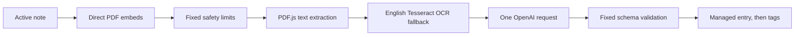

# Minimal v1 architecture

## Scope

This architecture implements [V1_SPEC.md](V1_SPEC.md), not the broader historical design. It targets one personal macOS Obsidian setup. Deferred capabilities are listed in [BACKLOG.md](BACKLOG.md).

## Pipeline



Attachments are processed sequentially. Oversized or unsupported PDFs fail rather than being truncated, chunked, or sent through a complex fallback.

## Modules

### Plugin shell

`src/main.ts` loads settings, registers the command/settings tab, and unloads resources. Startup performs no document processing.

### Command and run controller

The command validates the active Markdown note, resolves embedded PDFs, opens the modal, and processes up to the fixed v1 limit one at a time. It owns cancellation and per-attachment outcomes.

### Discovery

Use Obsidian `MetadataCache` and Vault APIs to resolve unique direct local PDF embeds. Do not scan with a broad Markdown regex, follow ordinary links, recurse through notes, or resolve remote URLs.

### Extraction

- PDF.js reads and extracts ordered page text.
- Pages below the fixed usable-text threshold are rendered with the tested print intent.
- The Tesseract adapter uses bundled worker JavaScript, WASM, and English data.
- Inputs are rejected before violating byte/page/pixel/text/time ceilings.

The macOS compatibility implementation and findings are documented in [SPIKE_RESULTS.md](SPIKE_RESULTS.md).

### Analysis

A single provider interface keeps OpenAI SDK types out of domain/orchestration code, without building unused multi-provider machinery.

The OpenAI adapter:

- Uses the official SDK and Responses API
- Uses fixed `gpt-5.6-luna`
- Requests fixed schema-constrained English output
- Sends no filename, note name, vault path, filesystem path, or arbitrary metadata
- Sets `store: false`
- Accepts an abort signal
- Maps provider errors into redacted attachment failures

No chunking, custom prompts, extra metadata, model selection, or provider fallback exists in minimal v1.

### Validation and rendering

A versioned runtime schema validates a document-grounded title, summary, tags, document type/date, entities, source language, warnings, model, and timestamp. Model text never supplies Markdown or ownership syntax.

A deterministic renderer escapes untrusted values and creates the exact native Obsidian callout structure from `V1_SPEC.md`.

### Persistence

For a validated attachment:

1. Use a conflict-aware Vault transformation against the latest note text.
2. Validate the contiguous top-of-body Objest callouts and exact source identity lines, tolerating one frontmatter separator line and excluding Markdown fenced code.
3. Insert or replace only the matching callout.
4. Preserve content outside Objest-owned callouts.
5. Migrate exact legacy HTML-marker output to callouts; reject malformed legacy output.
6. After the body succeeds, add normalized tags through `processFrontMatter`.

There is no cross-operation transaction. A tag failure after a valid body write is reported and can be repaired by rerunning. Never restore an old whole-file snapshot over current user edits.

Minimal v1 leaves unmatched old entries and old generated tags unchanged. Stale detection, rename migration, provenance, and cleanup are backlog work.

### Settings

Minimal settings contain only:

- Selected OpenAI SecretStorage identifier
- Versioned privacy consent state

The model, OCR language, output language, limits, and prompt are fixed in v1. Remove or hide development settings that imply unsupported configurability.

## Minimal domain contracts

```ts
interface ExtractedPage {
	pageNumber: number;
	method: 'embedded' | 'ocr';
	text: string;
	warnings: string[];
}

interface V1AttachmentAnalysis {
	schemaVersion: 2;
	promptVersion: 2;
	title: string;
	summary: string;
	tags: string[];
	documentType: string | null;
	documentDate: string | null;
	entities: string[];
	sourceLanguage: string | null;
	warnings: string[];
	model: string;
	processedAt: string;
}
```

Exact runtime limits and owned-callout format come from [V1_SPEC.md](V1_SPEC.md).

## Run lifecycle

1. Capture the active Markdown source file.
2. Resolve/deduplicate direct embedded PDFs.
3. Enforce run/file/page limits before expensive work when possible.
4. Ensure an OpenAI secret exists.
5. Before the first OpenAI request, obtain versioned consent.
6. For each PDF:
   1. Read through Vault API.
   2. Extract text and OCR scanned pages locally.
   3. Normalize and enforce the fixed text cap.
   4. Make one bounded OpenAI request.
   5. Validate the fixed schema.
   6. Enter non-cancellable persistence and write body then tags.
7. Show written, failed, and cancelled counts.
8. Dispose workers and document-derived buffers.

If replacement analysis fails, preserve the existing entry.

## Safety boundaries retained despite minimal scope

Minimal does not mean unsafe:

- Source PDFs remain local.
- Only the payload categories in V1 spec may reach OpenAI after consent.
- Secrets never enter ordinary settings, prompts, notes, logs, or fixtures.
- PDF/OCR/model/path/Markdown data is untrusted and bounded.
- No document-derived intermediates or raw provider payloads are persisted.
- No remote JavaScript or WASM is downloaded or executed.
- Owned-callout corruption and malformed legacy markers fail closed.
- Existing tags are never removed.
- Normal tests use fake providers and synthetic/redistributable fixtures.

## Dependency direction

```text
Obsidian shell/UI -> run controller -> domain types/interfaces
                           |-> PDF.js/Tesseract adapters
                           |-> OpenAI adapter
                           `-> Obsidian persistence adapter
```

Keep boundaries small enough to test; do not add abstractions solely for backlog features.
