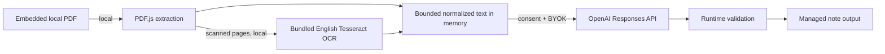

# Minimal v1 privacy and data flow

## Summary

Objest treats each PDF as sensitive. PDF parsing and English OCR happen locally inside Obsidian. AI analysis is not local: bounded normalized PDF text is sent to OpenAI after a one-time disclosure and consent, using the user's own API key.

The authoritative payload and limits are in [V1_SPEC.md](V1_SPEC.md).

## Data flow

## Sent to OpenAI

One bounded request per accepted PDF contains only:

- Normalized text extracted/OCRed from that PDF
- Numeric page-range/order labels
- Fixed versioned analysis instructions
- Fixed versioned structured-output schema

Every request uses `store: false` and fixed `gpt-5.6-luna`.

## Not sent

- Source PDF bytes or rendered page images
- Attachment filename
- Vault path or absolute filesystem path
- Note name or unrelated note body text
- Other notes/attachments/vault content
- Arbitrary metadata
- API key as request content; it is used only for authorization

## Local OCR assets

Minimal v1 bundles:

- PDF.js worker
- Tesseract worker JavaScript
- Tesseract WASM core
- Compressed English trained data

Minimal v1 does not download OCR worker code, WASM, or language data. Additional languages and their disclosed data downloads are backlog work.

## Local persistence

Objest persists only:

- Selected Obsidian secret identifier
- Privacy-consent status and consent version
- Final rendered summaries/metadata inside Objest markers
- Generated tags merged into the note's standard `tags`

Objest does not persist:

- Extracted PDF text
- OCR output
- Rendered page images
- Normalized request input
- Raw OpenAI requests/responses
- Debug copies of document content

Intermediates exist only in memory for the current attachment and are released after completion or cancellation.

## API key

Objest requires Obsidian 1.11.4 or newer and uses `SecretStorage`/`SecretComponent`. Ordinary plugin `data.json` stores only the selected secret identifier, never the key value. The key must not appear in prompts, notes, logs, errors, fixtures, screenshots, or telemetry.

## Consent

Before the first OpenAI request, Objest explains:

- PDF parsing and English OCR are local
- Bounded normalized PDF text is sent to OpenAI
- Source PDF, filename/path, and unrelated note/vault content are not sent
- The user supplies and is billed through their OpenAI API key
- What Objest persists and does not persist

Declining/dismissing performs no OpenAI request and no note write. Settings allow consent review/reset. Material payload/provider changes increment the consent version and require renewed acceptance.

## Logging

Production diagnostics may include stage, counts, timing, redacted error category, and a run-local opaque attachment ID. They must not include filenames/paths unless required in local user-facing UI, document text, model output, authorization values, or unrelated note content.

## Third party

OpenAI receives the allowed normalized analysis input under the user's OpenAI account and applicable terms. Before first use, documentation should link to current OpenAI privacy/data-usage information. Minimal v1 has no telemetry and no other runtime network destination.
